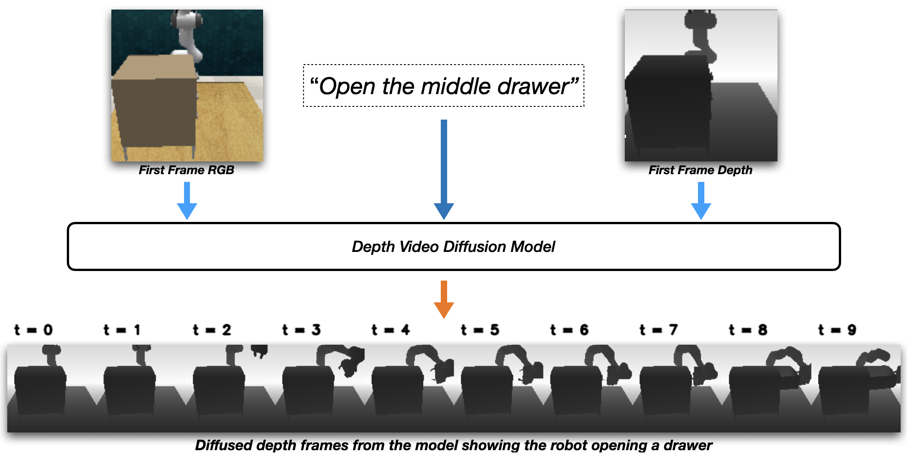

<p align="center">
  <h1 align="center">Video Diffusion for Robot Policy Learning</h1>
</p>
<p align="center">
  <h3 align="center">Project for EE8520: Generative AI, Inverse Problems and Conditional
Generation</h3>
</p>


### For details about the project please refer to our [project paper](https://drive.google.com/file/d/1IEzTa9sDVFlx4WfWURyZMzd7_s_hJqE3/view?usp=sharing)

# Usage
## Environment Setup

This code was developed and tested in Ubuntu 22, with Python 3.10. We recommend creating a new conda environment to work with this code base. Once you create and activate a conda environment, install the required packages and dependencies using:

```
pip install -r requirements.txt
```

## Dataset
We are using the dataset from [PerAct](https://peract.github.io). You can download the train dataset of PerAct from this link: [dataset](https://drive.google.com/drive/folders/0B2LlLwoO3nfZfi1LbGJINXJ1TUQxN1pxa3Q1MzlDZmY0WGk1RmhxazZvNFEydUREbXM4cTA?resourcekey=0-DpkG5eIqkwjKJ84qFcaUfw). The authors suggest using [rclone](https://rclone.org/drive/) for downloading the dataset given its large size.

Once you download the dataset, the folder structure should look like this:
```text
peract_dataset/
├── task_1/
│   └── all_variations/
│       └── episodes/
│           ├── episode_000/
│           │   ├── <files and folders>
│           │   ├── rgb/
│           │   ├── depth/
│           │   ├── actions.pkl
│           │   └── ...
│           ├── episode_001/
│           │   └── ...
│           └── ...
├── task_2/
│   └── all_variations/
│       └── episodes/
│           ├── episode_000/
│           ├── episode_001/
│           └── ...
└── ...
```

Use the scripts/process_dataset.py script to process this dataset structure into this structure to keep things consistent with the dataloaders.
```
peract_processed_dataset/
├── episode0/
│   ├── <same contents as original episode folder>
│   ├── rgb/
│   ├── depth/
│   ├── actions.pkl
│   └── ...
├── episode1/
│   ├── ...
├── episode2/
│   ├── ...
├── episode3/
│   ├── ...
└── ...
```
Note: make sure the original dataset folder name is ```data/peract_dataset```. The script will create a folder named ```data/peract_processed_dataset``` and store the processed dataset.

## Training
There are two training scripts: ```train.py``` and ```train_pl.py```. The latter is wrapped using the pytorch lightning package to make use of multi GPU for parallelization. 

We also provided a ```config.yaml``` file that has all tunable hyperparameters required for the training. Run the ```train_pl.py``` script to train the model. Before running the ```train_pl.py``` script, make sure to edit the ```devices``` parameter in the main function to match the GPUs your computer has. While training using the ```train_pl.py``` script, the checkpoints is saved in the ```models``` folder after every epoch which allows you to test the model's performance as the model is being trained.

## Sampling
If you wish to sample from a pretrained model, download the [checkpoint](https://drive.google.com/file/d/1cl0FJlqmUKsC2yz3l4MKm7p0E62oC5bX/view?usp=share_link) and store it in a ```models``` folder. Use the ```test.py``` script to run the inference and sample from the pretrained video diffusion model. The script saves the sampled images in a ```diffused_frames``` folder.

Note: Make sure to check the checkpoint path in the ```main``` function of the ```test.py``` script.


